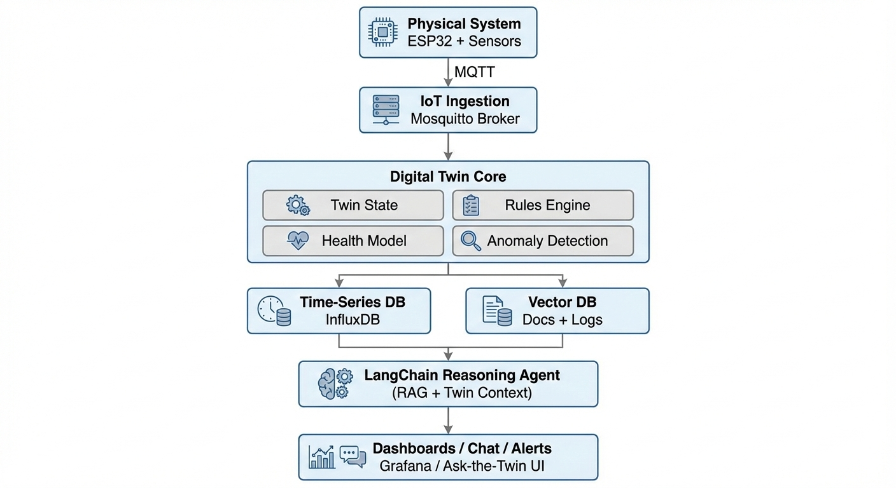

# LLM-Powered Digital Twin for Physical Systems  
### with Drones, Robots, and IoT Sensors

## Overview

This project implements a **real-time, multi-agent Digital Twin** that mirrors
a physical system composed of **static IoT sensors, mobile robots, and autonomous drones**.

The Digital Twin maintains live system state, detects anomalies, evaluates health,
and integrates a **LangChain-powered LLM agent** that can reason about the system,
explain behavior in natural language, and support mission-level decision-making.

This project explores the intersection of **Physical AI, Robotics, and LLM-based reasoning**.

---

## System Architecture

### Architecture Layers

1. **Physical Layer**
   - Static IoT sensors (temperature, vibration, power, environment)
   - Mobile robots (joint states, load, motor health)
   - Autonomous drones (position, battery, flight status, perception metadata)

2. **Data Ingestion Layer**
   - MQTT for real-time telemetry
   - Optional ROS2 → MQTT bridge for robots and drones

3. **Digital Twin Core**
   - System Twin (environment & infrastructure)
   - Agent Twins (robots & drones)
   - Rule-based evaluation
   - Anomaly detection

4. **Cognitive Layer**
   - LangChain-powered LLM agent
   - Retrieval-Augmented Generation (RAG)
   - Natural language interaction & reasoning

---

## Features

- 📡 Live IoT telemetry via MQTT
- 🤖 **Mobile Digital Twins for robots**
- 🚁 **Autonomous drone Digital Twins**
- 📍 Real-time pose, battery, and health tracking
- 🧠 Rule-based system and agent health evaluation
- 🚨 Anomaly detection across sensors and agents
- 🔗 LangChain-powered reasoning agent
- 💬 Natural language interaction with the Digital Twin
- 📊 Time-series visualization with Grafana

---

## Digital Twin Model

### System Twin
Represents the global physical environment:
- Infrastructure state
- Environmental conditions
- Aggregate health metrics

### Agent Twins (Robots & Drones)

Each robot or drone is modeled as an **independent agent twin**:

- Position & velocity
- Battery / power state
- Health & fault status
- Active mission
- Attached sensors

This enables **multi-agent physical system modeling** and future coordination logic.

---

## Example Questions the Twin Can Answer

- *Why did drone alpha abort its inspection mission?*
- *Is robot beta safe to continue operation under current load?*
- *Which agent should inspect the detected anomaly?*
- *What changed in system behavior over the last hour?*

---

## Tech Stack

### Hardware
- IoT MCUs and sensors
- Mobile robots
- Autonomous drones

### Software
- Python
- FastAPI
- MQTT (Mosquitto)
- Optional ROS2 bridge
- InfluxDB (time-series storage)
- Vector Database (RAG)

### AI & Visualization
- LangChain
- Retrieval-Augmented Generation (RAG)
- Grafana dashboards

---

## Why This Matters

Traditional monitoring systems report metrics.

This Digital Twin:
- **Maintains internal state**
- **Understands physical agents**
- **Reasons about cause and effect**
- **Explains behavior in human language**

By integrating LLMs as a cognitive layer, this project demonstrates how
**Physical AI systems can become explainable, interactive, and decision-aware**.

---

## Future Work

- Autonomous mission planning for drones and robots
- Multi-agent coordination and task allocation
- Predictive maintenance with ML models
- Simulation ↔ real-world twin synchronization
- 3D visualization of agent twins

---

## Project Focus

**Keywords**:  
Digital Twin · Physical AI · Robotics · Drones · IoT · LangChain · RAG · Multi-Agent Systems
