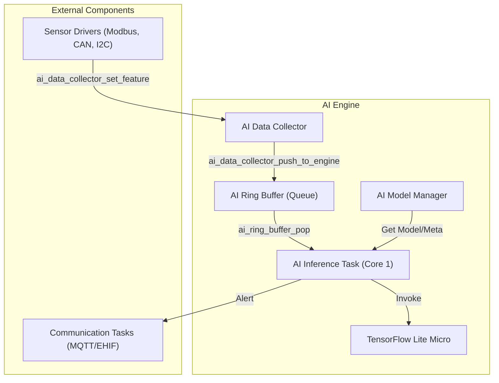

# Technical Specification: Edge AI Engine

The **Edge AI Engine** is a high-performance, real-time inference component designed for ESP32-S3. It provides on-device anomaly detection and predictive maintenance capabilities for industrial IoT applications using TensorFlow Lite Micro (TFLM).

## 1. Overview
The engine transforms raw sensor telemetry into actionable insights (anomaly scores) by running pre-trained machine learning models. It supports multiple operational modes ranging from simple statistical checks to advanced sequence-based GRU models.

## 2. Architecture

### 2.1 Component Diagram


### 2.2 Key Files
| File | Responsibility |
| :--- | :--- |
| `ai_inference.cpp` | Main task loop, TFLM interpreter setup, and inference logic. |
| `ai_model_manager.c` | Handles model storage (Flash/PSRAM) and normalization metadata. |
| `ai_data_collector.c` | Thread-safe interface for feeding sensor data into the AI pipeline. |
| `ai_ring_buffer.c` | FreeRTOS-queue based buffer to decouple data collection from inference. |
| `ai_config.h` | Global hyperparameters (dimensions, thresholds, task priorities). |

## 3. Operational Modes

### 3.1 AI_MODE_STATISTICAL (Legacy/Fallback)
- **Method**: Z-Score analysis on primary features.
- **Trigger**: Used when a valid TFLite model is not present or schema version mismatches.
- **Logic**: Evaluates vibration and temperature against hardcoded mean/std values.

### 3.2 AI_MODE_ANOMALY (MLP)
- **Method**: Multi-Layer Perceptron (Autoencoder or Binary Classifier).
- **Complexity**: Low latency, high throughput.
- **Best For**: Point anomalies (sudden spikes or out-of-range values).

### 3.3 AI_MODE_PREDICTIVE (GRU)
- **Method**: Gated Recurrent Unit with a Sliding Window.
- **Window Size**: 10 steps (default).
- **Logic**: Uses Recurrent Neural Networks to analyze trends over time.
- **Best For**: Drifting sensors or gradual mechanical degradation.

## 4. Configuration & Hyperparameters

Defined in `include/ai_config.h`:

- **AI_FEATURE_DIM (6)**: The engine expects a 6-dimensional input vector.
- **AI_WINDOW_SIZE (10)**: Number of consecutive samples used for sequence models (GRU).
- **AI_INFERENCE_INTERVAL_MS (500)**: Target sampling/inference rate.
- **AI_WARN_THRESHOLD (0.65)**: Triggers warnings in logs.
- **AI_ALARM_THRESHOLD (0.85)**: Triggers critical alerts and system-wide notifications.
- **AI_DEBOUNCE_CYCLES (3)**: Number of consecutive anomalies required to trigger an alert.

## 5. Normalization Pipeline
Before inference, the engine performs min-max normalization using parameters stored in `ai_model_manager`:
$$x_{norm} = \frac{x - min}{max - min}$$

Current hardcoded features (from `ai_model_manager.c`):
1. `pump_vibration`
2. `pump_pressure`
3. `smoke_obscuration`
4. `facp_voltage`
5. `sprinkler_flow`
6. `heat_rate`

## 6. Integration Guide

### 6.1 Feeding Data
To feed data from a sensor task:
```c
#include "ai_data_collector.h"

// 1. Update features
ai_data_collector_set_feature(0, vibration_value);
ai_data_collector_set_feature(1, pressure_value);

// 2. Commit the vector (usually at the end of a sampling cycle)
ai_data_collector_push_to_engine();
```

### 6.2 Handling Results
Other tasks can query the latest results:
```c
ai_result_t result;
if (ai_inference_get_last_result(&result) == ESP_OK) {
    if (result.is_anomaly) {
        // Trigger local action (e.g. shut down motor)
    }
}
```

## 7. Memory Management
The engine utilizes **PSRAM (SPIRAM)** for:
- **TFLM Tensor Arena**: 64 KB (configurable).
- **Normalization Metadata**: Allocated at runtime.
- **Model Storage**: Currently embedded in flash, but managed via pointers to allow future OTA updates to PSRAM.
